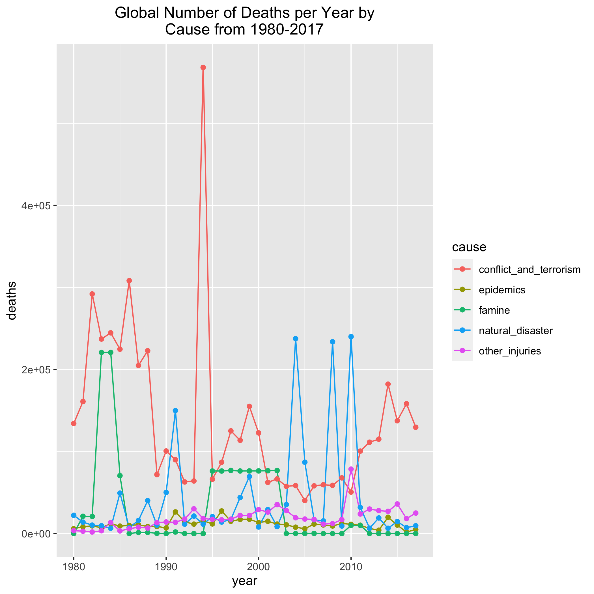
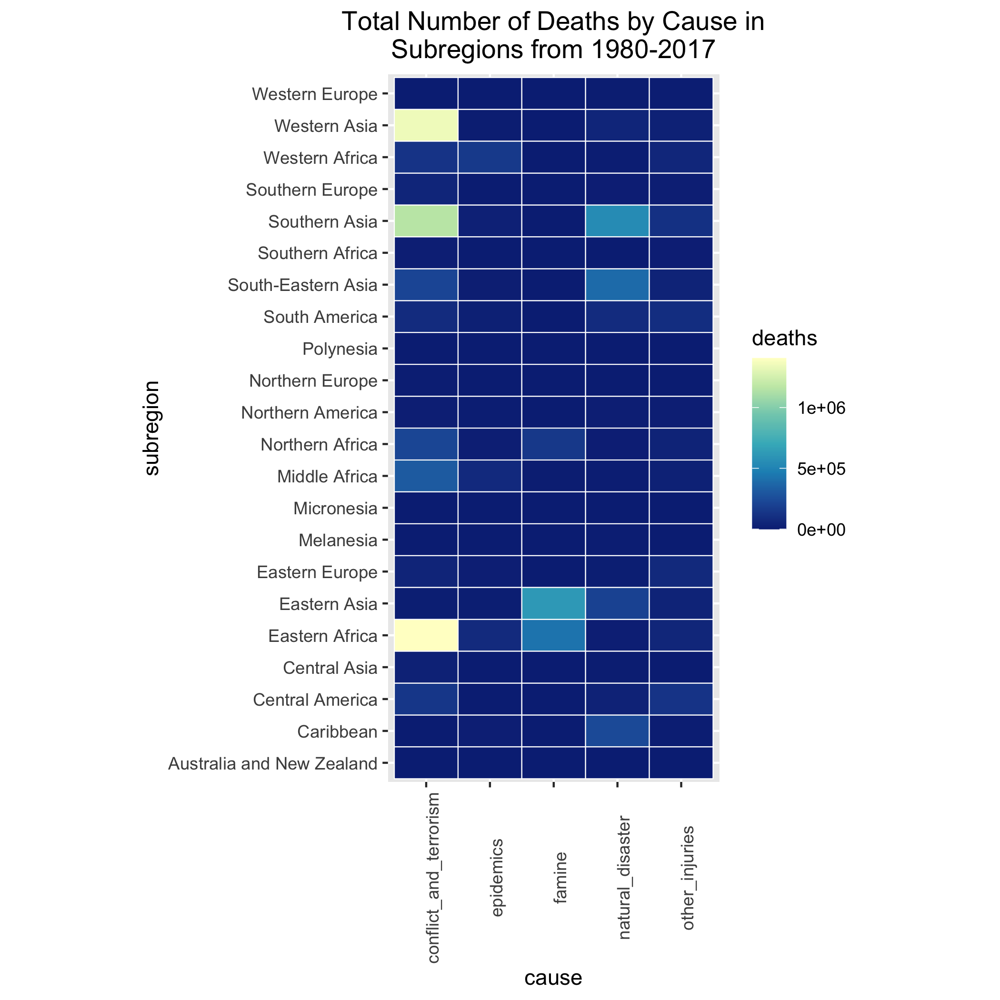

BIOS 611 Project 1
==================

World-wide Causes of Death Other than Disease, 1980-2017
--------------------------------------------------------

### Introduction

People all over the world routinely face challenges that pose a risk to their health and well-being, many of which arise from external factors beyond the control of the individual. These challenges can be social, political, or environmental, though realistically they are a combination of all of these factors.

This project will attempt to uncover both spatial and temporal relationships between various causes of non-disease deaths and the frequency with which they occurred in countries all over the world from 1980-2017.

### Datasets

The datasets I will be using are publicly available for download on Kaggle:

[global causes of deaths other than disease](https://www.kaggle.com/tahminashoaib86/global-cause-of-the-deaths-other-than-diseases)

[country to continent mapping](https://www.kaggle.com/statchaitya/country-to-continent)

Note that I renamed the first file to "Causes_of_Deaths.csv" for analysis.

### Preliminary Figures

This line graph shows the global number of deaths from five major causes each year from 1980- 2017. Because the number of deaths varies so greatly, it was difficult to scale the graph to get a clear indication of any trends. Addressing this is one of the aims of the project.

This heatmap shows the total number of deaths by cause from 1980-2017 in various subregions around the world. Similarly to the line graph, it was difficult to scale the death counts to get a clear picture of what is going on and a large part of this project will being strategically adjusting for this.

### Using This Project

You will need Docker, and you will need be able to run docker as your user.

First you will need to build the container:
> docker build . -t project1_env

This Docker container is based on rocker/verse. To run rstudio server:
> docker run -v $(pwd):/home/rstudio -p 8787:8787 -e PASSWORD=yourpassword -t project1_env

You will then need to connect your machine to port 8787.

### Makefile

The Makefile is a nice resource to understand the aims and capabilities of the project.

For example, to generate the preliminary figures as seen above, you can use the command
> make figures/cause_line_prelim.png

### The Final Report

To generate the final report summarizing this project, you must first connect to the Rstudio server as described in *Using This Project*. Then in the terminal run the command
> make clean

followed by
> make project_1_report.pdf

Note that you will first need to download the datasets linked above to the *source_data* folder and rename the cause dataset from "Caused of Deaths.csv" to "Causes_of_Deaths.csv".
