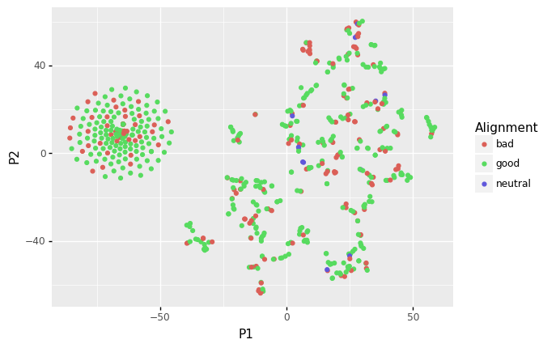

### Lauren Koval

```{r setup, include=FALSE}
knitr::opts_chunk$set(echo = TRUE)
```


## Q1

### Vizualizing Data

First load necesssary libraries
```{r import libraries, echo=TRUE, eval=TRUE, results='hide', warning=FALSE, message=FALSE}
library(tidyverse)
library(gbm)
library(factoextra)
library(MLmetrics)
library(ggfortify)
library(caret)
library(e1071)

```

After reading in the file and getting a feel for the data, I created a scatter plot of the heights and weights colored by gender. There is a much clearer distinction between Males and Females than there was in homework 4.
```{r read_data, echo=TRUE, eval=TRUE, warning=FALSE, message=FALSE}
df <- read_csv("datasets_26073_33239_weight-height.csv")

head(df)

ggplot(df, aes(x=Height, y=Weight, color=Gender))+geom_point()

```


### Splitting Data

Next I mutate the dataframe to code "Male" as 1 and "Female" as 0. I then split the data into 3 groups: train, validate, and test.

```{r split_data, echo=TRUE, eval=TRUE}
df<- df %>% mutate(gen_bin=ifelse(Gender=="Male", 1, 0))

spec = c(train = .7, test = .15, validate = .15)

mod_groups <-  sample(cut(
  seq(nrow(df)), 
  nrow(df)*cumsum(c(0,spec)),
  labels = names(spec)
))

split_groups <- split(df, mod_groups)

train <- split_groups$train
test <- split_groups$test
val <- split_groups$validate
```

### GBM
I then trained a gradient boosting machine to predict the gender. 

```{r gbm, echo=TRUE, eval=TRUE, message=FALSE, warning=FALSE, results="hide"}
gen_gbm <- gbm(gen_bin~ Height + Weight, data=train,)

gbm_pred <- predict(gen_gbm, newdata = val, type="response")

```


### Results
From there, I calculated the accuracy and the F1 score which both indicate the model is pretty good, definitely better than the models from homework 4. In homework 4, the accuracy for the GBM was about 0.5 and I was unable to calculate an F1 score. 
```{r gbm results, echo=TRUE, eval=TRUE}
sum((gbm_pred>0.5)==val$gen_bin)/nrow(val)

F1_Score(val$gen_bin, as.numeric(gbm_pred>0.5))
```


## Q2

### Exploration
For Q2 I read in the data and got a feel for what I was looking at
```{r read_data_2, echo=FALSE, eval=TRUE, warning=FALSE, message=FALSE}
df <- read_csv("datasets_38396_60978_charcters_stats.csv")

head(df)
```


During the exploration, I found that there were characters missing their alignment.
```{r no_alignment, echo=FALSE, eval=TRUE, warning=FALSE, message=FALSE}
df %>% filter(is.na(Alignment)==TRUE)

```

The character "Nova" appeared twice with different statistics
```{r name_dup, echo=FALSE, eval=TRUE, warning=FALSE, message=FALSE}

df %>% filter(Name=="Nova")
```


And that some characters had stats greater than 100. I'm no superhero expert, but that doesn't make intuitive sense. 
```{r over_100, echo=FALSE, eval=TRUE, warning=FALSE, message=FALSE}
df %>% filter_at(vars(!c(Name,Alignment,Total)),any_vars(.>100))

```


All of these records were dropped from the dataframe. This ultimately drops 10 records from the initial dataset.The cleaned data is written to a csv.

```{r clean, echo=TRUE, eval=TRUE, warning=FALSE, message=FALSE}
df <- df %>% filter(is.na(Alignment)==FALSE) %>% filter(Name!="Nova") %>% filter_at(vars(!c(Name,Alignment,Total)),all_vars(.<101))

write_csv(df, "cleaned_super_stats.csv")
```


### PCA

Let's perform a PCA on the numerical columns. As we can see, most of the variation is accounted for by a single component. The first principal component accounts for ~95% of the variation.
```{r pca, echo=TRUE, eval=TRUE, message=FALSE, warning=FALSE}
pcs <- prcomp(df %>% select(!c(Name,Alignment)))
summary(pcs)
fviz_eig(pcs)

```

The values of statistics for the powers are already scaled from 0-100 since I dropped records where this was not the case. I don't think normalizing would be the most useful here. The total column is really the sum of the the other columns but this shouldn't be included in the PCA. I expect this column to increase the variance in the first component.  


```{r norm_tot, echo=TRUE, eval=TRUE, warning=FALSE, message=FALSE}
df$count <- rowSums(df %>% select(!c(Name,Alignment, Total)))
df %>% filter(Total!=count)
```

### Redo PCA

Let's drop the Total (& recently added count) column and redo the PCA. We see that it now requires 3 components to account for 85% of the variation.

```{r pca_2, echo=TRUE, eval=TRUE, message=FALSE, warning=FALSE}
pcs_2 <- prcomp(df %>% select(!c(Name, Alignment, Total, count)))
summary(pcs_2)
fviz_eig(pcs_2)
autoplot(pcs_2, data=df %>% select(!c(Name, Alignment, Total, count)))
```


## Q3 & Q4

### TSNE

For dimensionality reduction, we used TSNE in scikit-learn. The code, which I have included below, can be run from the file **homework_5_python.py**. The results were written to a csv and a figure was produced using plotnine then replicated using ggplot in R

```{r py_code, echo=TRUE, eval=FALSE}
import pandas as pd
import numpy as np
from sklearn.manifold import TSNE
from plotnine import *


df=pd.read_csv("cleaned_super_stats.csv")

tsne = TSNE(n_components=2, perplexity=5, early_exaggeration=20, learning_rate=100);
projection = pd.DataFrame(tsne.fit_transform(df[["Intelligence","Strength","Speed","Durability","Power","Combat"]]), columns=["P1","P2"])

df["P1"]=projection["P1"]
df["P2"]=projection["P2"]

df.to_csv("superhero_tsne.csv", index=False)

fig=(ggplot(df, aes("P1","P2",color="Alignment")))+geom_point()
fig.save("tsne_viz_py.png")
```

plotnine figure:





ggplot figure:

```{r tsne_viz_r, echo=TRUE, eval=TRUE, message=FALSE, warning=FALSE}
tsne <- read_csv("superhero_tsne.csv")
tsne %>% ggplot(aes(x=P1, y=P2, color=Alignment))+geom_point()
```


There does appear to be a very distinct radial cluster that contains both good and bad alignments.There seems to be more of a structure here than when we used PCA for dimensionality reduction.

## Q5

### Caret
Here we use the caret package to determine the optimal parameters to use for training a gbm to predict the Alignment based on the stats. Caret suggests 50 trees.
```{r caret, echo=TRUE, eval=TRUE, message=FALSE, warning=TRUE, results="hide"}

ctrl <- trainControl(method = "repeatedcv", number = 3, savePredictions = "all")

mod_fit <- train(Alignment~Intelligence+Strength+Speed+Durability+Power+Combat, data=df, method = "gbm", trControl= ctrl)

```

```{r caret_results, echo=TRUE, eval=TRUE, message=FALSE, warning=FALSE}
mod_fit$results

mod_fit$finalModel
```

## Q6

We need to use strategies like k-folds cross validation to help prevent over and underfitting of the model. K-folds ensures that we get observations of all types in both the training and the test sets at some point. This is especially important in instances of limited data. 


## Q7

Recursive feature elimination iteratively removes the weakest feature of a dataset until the specified number of features is retained. Ultimately you should end up with the strongest features to use as predictors for classification and regression problems.
